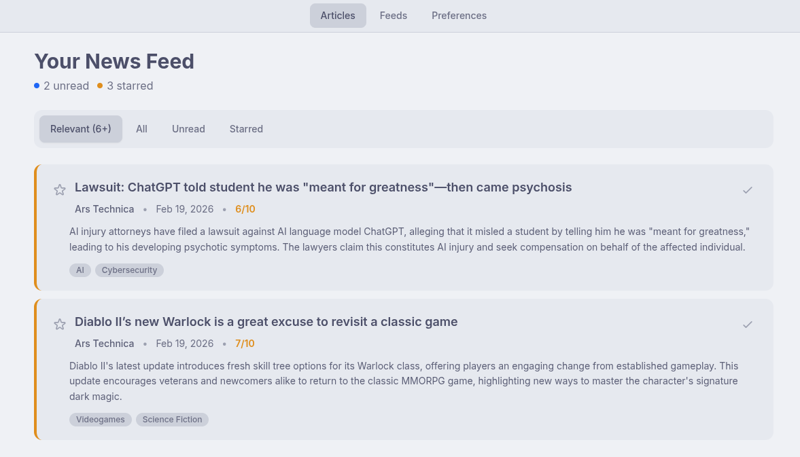
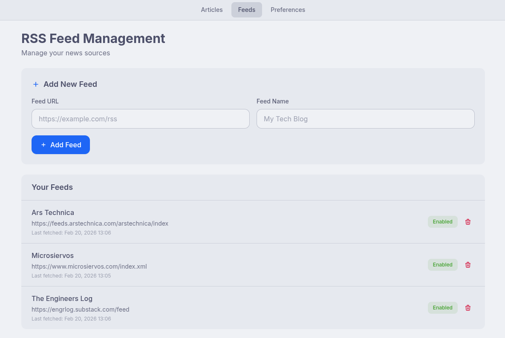
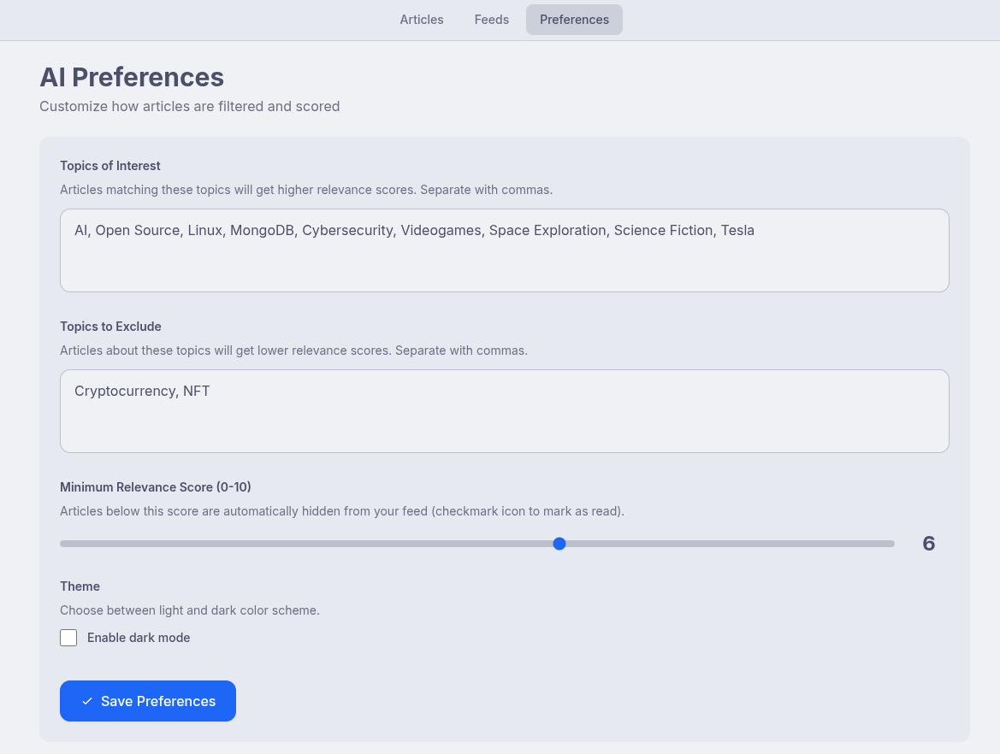
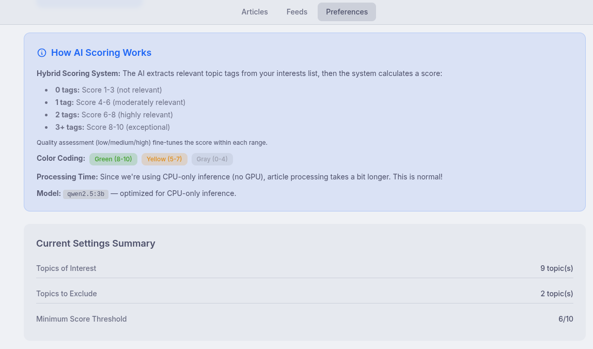
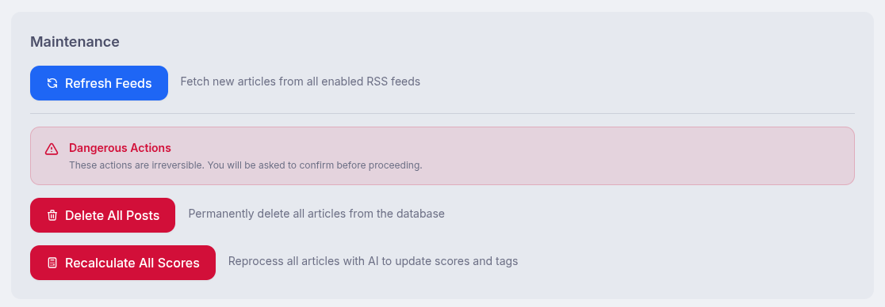

# 📰 News Diet

**An AI-powered RSS news aggregator inspired by Google Reader** — Self-hosted, privacy-focused, and optimized for CPU-only environments.

## 🌟 Features

- **🤖 Local AI Filtering**: Uses Ollama with `qwen2.5:3b` to score article relevance (0-10) based on your interests
- **📡 RSS Feed Management**: Web UI to add, enable/disable, and manage RSS feeds
- **⚙️ Customizable Preferences**: Configure topics of interest and exclusions for personalized AI scoring
- **🎨 Catppuccin Theme**: Beautiful pastel color scheme with Latte (light) and Frappé (dark) variants
- **🌙 Dark Mode**: Toggle between light and dark themes with persistent preference
- **📝 AI Summaries**: Automatic article summarization and tagging
- **🔄 Automatic Fetching**: Background scheduler checks feeds every hour
- **💻 CPU-Optimized**: Designed for mini PCs and home labs without GPU requirements
- **📱 Mobile Responsive**: Works on desktop and mobile devices

## 🖼️ Screenshots

<div align="center">
  
  <br>
  <em>Main dashboard: relevant news, AI scores, summaries</em>
</div>

<div align="center">
  
  <br>
  <em>Feed management: add, enable/disable, monitor feeds</em>
</div>

<div align="center">
  
  <br>
  <em>Preferences: topics of interest, exclusions, dark mode</em>
</div>

<div align="center">
  
  <br>
  <em>AI scoring: see how relevance is determined for each article</em>
</div>

<div align="center">
  
  <br>
  <em>Maintenance: update, and reset tools for your data</em>
</div>

## 📋 Requirements

### Hardware
- **Minimum**: 8GB RAM, dual-core CPU
- **Recommended**: 16GB RAM, quad-core CPU
- **GPU**: Not required (CPU-only inference)

### Software
- Docker & Docker Compose
- 5GB free disk space (for Ollama model)

## 🚀 Quick Start

### Requirements Check

This project works with both Docker and Podman:
- **Docker**: Use `docker compose up -d`
- **Podman**: Use `podman-compose up -d` (install with `pip install podman-compose`)

### 1. Clone the Repository

```bash
git clone <your-repo-url>
cd news-diet
```

### 2. Configure Environment (Optional)

Copy the example environment file and customize if needed:

```bash
cp .env.example .env
```

Default settings work out of the box. Key configurations:
- `OLLAMA_MODEL=qwen2.5:3b` (recommended for CPU)
- `RSS_FETCH_INTERVAL_HOURS=1` (fetch frequency)
- `OLLAMA_TIMEOUT=120` (seconds, important for CPU inference)

### 3. Start the Application

**With Docker:**
```bash
docker compose up -d
```

**With Podman:**
```bash
podman-compose up -d
# Or if using systemd
podman kube play docker-compose.yml
```

**First-time setup notes:**
- Ollama will automatically download the `qwen2.5:3b` model (~2GB) on first startup
- This can take 5-10 minutes depending on your internet connection
- The app will be ready once all services are healthy

### 4. Access the Application

Open your browser and navigate to:

```
http://localhost:8000
```

## 📖 Usage Guide

### Dashboard (Main View)

- **View Articles**: All fetched articles with AI scores and summaries
- **Filters**: Relevant (min score) / All / Unread / Starred tabs
- **Mark as Read**: Click checkmark icon to toggle read status
- **Star Articles**: Click star icon to bookmark important articles
- **Refresh News**: Manual refresh button (shows processing indicator)

### Feed Management (`/feeds`)

- **Add Feeds**: Enter RSS feed URL and name
- **Enable/Disable**: Toggle feeds without deleting them
- **Monitor Health**: See last fetch time and error counts
- **Delete Feeds**: Remove feeds you no longer want
  - **Note**: By default, deleting a feed also removes all articles from that feed to keep the database clean. You can disable this behavior by setting `DELETE_ARTICLES_ON_FEED_REMOVAL=false` in your `.env` file.

### Preferences (`/preferences`)

- **Topics of Interest**: Comma-separated list (e.g., "Python, DevOps, AI")
- **Topics to Exclude**: Filter out unwanted topics (e.g., "Crypto, NFT")
- **Minimum Relevance Score**: Articles below this threshold are automatically hidden

**How AI Scoring Works (Hybrid Approach):**
1. Article is fetched from RSS feed
2. Local LLM extracts relevant topic tags from your interests list
3. LLM assesses article quality (low/medium/high)
4. System calculates score based on number of matching tags:
   - **0 tags** → Score 1-3 (not relevant)
   - **1 tag** → Score 4-6 (moderately relevant)
   - **2 tags** → Score 6-8 (highly relevant)
   - **3+ tags** → Score 8-10 (exceptional)
5. Quality modifier adjusts score within the range
6. Generates 3-4 sentence summary in original language

## 🏗️ Architecture

### Tech Stack

- **Backend**: FastAPI (Python 3.11+)
- **Database**: MongoDB
- **AI Engine**: Ollama (OpenAI-compatible API)
- **Frontend**: Jinja2 + TailwindCSS + HTMX + Catppuccin theme
- **Task Scheduler**: APScheduler
- **Containerization**: Docker Compose

### Project Structure

```
news-diet/
├── app/
│   ├── main.py              # FastAPI application
│   ├── config.py            # Configuration settings
│   ├── database.py          # MongoDB connection
│   ├── models.py            # Pydantic models
│   ├── services/
│   │   ├── ai_processor.py  # Ollama integration
│   │   ├── feeder.py        # RSS parsing
│   │   └── scheduler.py     # Background tasks
│   └── templates/           # HTML templates
├── docker-compose.yml
├── Dockerfile
└── requirements.txt
```

### Docker Services

1. **app**: FastAPI application (port 8000)
2. **mongo**: MongoDB database (port 27017)
3. **ollama**: LLM inference engine (port 11434)

## ⚙️ Configuration

### Environment Variables

| Variable | Default | Description |
|----------|---------|-------------|
| `MONGODB_URL` | `mongodb://mongo:27017` | MongoDB connection string |
| `MONGODB_DB` | `newsdiet` | Database name |
| `OLLAMA_BASE_URL` | `http://ollama:11434/v1` | Ollama API endpoint |
| `OLLAMA_MODEL` | `qwen2.5:3b` | LLM model to use |
| `OLLAMA_TIMEOUT` | `120` | Request timeout (seconds) |
| `RSS_FETCH_INTERVAL_HOURS` | `1` | How often to check feeds |
| `DELETE_ARTICLES_ON_FEED_REMOVAL` | `true` | Delete articles when feed is removed |
| `LOG_LEVEL` | `INFO` | Logging verbosity |

### Model Selection

**Recommended: `qwen2.5:3b`** (default)
- Size: ~2GB
- Fast on CPU
- Good quality summaries

**Alternative: `llama3.2:3b`**
- Size: ~2GB
- Good quality
- Slightly slower

**Alternative: `llama3.2:1b`**
- Size: ~1GB
- Even faster
- Lower quality

**NOT Recommended for CPU: 7B+ models**
- Too slow for real-time inference
- Will cause timeout issues

## 🔧 Troubleshooting

### Issue: "Model pull failed"

**Solution**: Check internet connection and disk space. Manually pull:
```bash
docker-compose exec ollama ollama pull qwen2.5:3b
```

### Issue: "Processing takes too long"

**Solution**: This is normal for CPU inference. Each article takes 10-30 seconds. Increase `OLLAMA_TIMEOUT` if needed:
```bash
# In .env file
OLLAMA_TIMEOUT=180
```

### Issue: "Feed fetch errors"

**Solution**: 
1. Check feed URL is valid RSS/Atom
2. Some feeds require User-Agent headers (future feature)
3. Temporarily disable problematic feeds in Feed Management

### Issue: "No articles appearing"

**Solution**:
1. Click "Refresh News" button
2. Check Docker logs: `docker-compose logs -f app`
3. Verify feeds are enabled in Feed Management
4. Ensure Ollama service is healthy: `docker-compose ps`

### Issue: "Out of memory"

**Solution**:
1. Use `llama3.2:1b` instead of `3b`
2. Reduce concurrent feed processing
3. Increase Docker memory allocation

## 📊 Monitoring

### View Logs

```bash
# All services
docker-compose logs -f

# Specific service
docker-compose logs -f app
docker-compose logs -f ollama
```

### Check Service Health

```bash
docker-compose ps
```

All services should show "healthy" status.

### Database Access

```bash
# MongoDB shell
docker-compose exec mongo mongosh newsdiet

# View collections
show collections

# Count articles
db.articles.countDocuments()
```

## 🔄 Maintenance

### Backup Data

```bash
# Backup MongoDB
docker-compose exec mongo mongodump --db newsdiet --out /tmp/backup
docker cp newsdiet-mongo:/tmp/backup ./backup
```

### Update Application

```bash
# Pull latest changes
git pull

# Rebuild containers
docker-compose up -d --build
```

### Reset Everything

```bash
# Stop and remove containers + volumes
docker-compose down -v

# Start fresh
docker-compose up -d
```

## 🤝 Contributing

Contributions welcome! This project is inspired by the late, great Google Reader and aims to bring that simplicity to the modern self-hosted world.

## 📜 License

MIT License - See LICENSE file for details

## 🙏 Acknowledgments

- **Google Reader**: For setting the gold standard in RSS readers
- **Ollama**: For making local LLMs accessible
- **FastAPI**: For the excellent async framework
- **HTMX**: For simplifying dynamic UIs

---

**Built with ❤️ for the self-hosting community**
